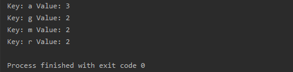

# Letter Frequency 

[](https://app.codacy.com/manual/orhantgrl/letter-frequency?utm_source=github.com&utm_medium=referral&utm_content=orhantgrl/letter-frequency&utm_campaign=Badge_Grade_Settings)


Input : 

```bash
ScalaProgramming
```

Output:


